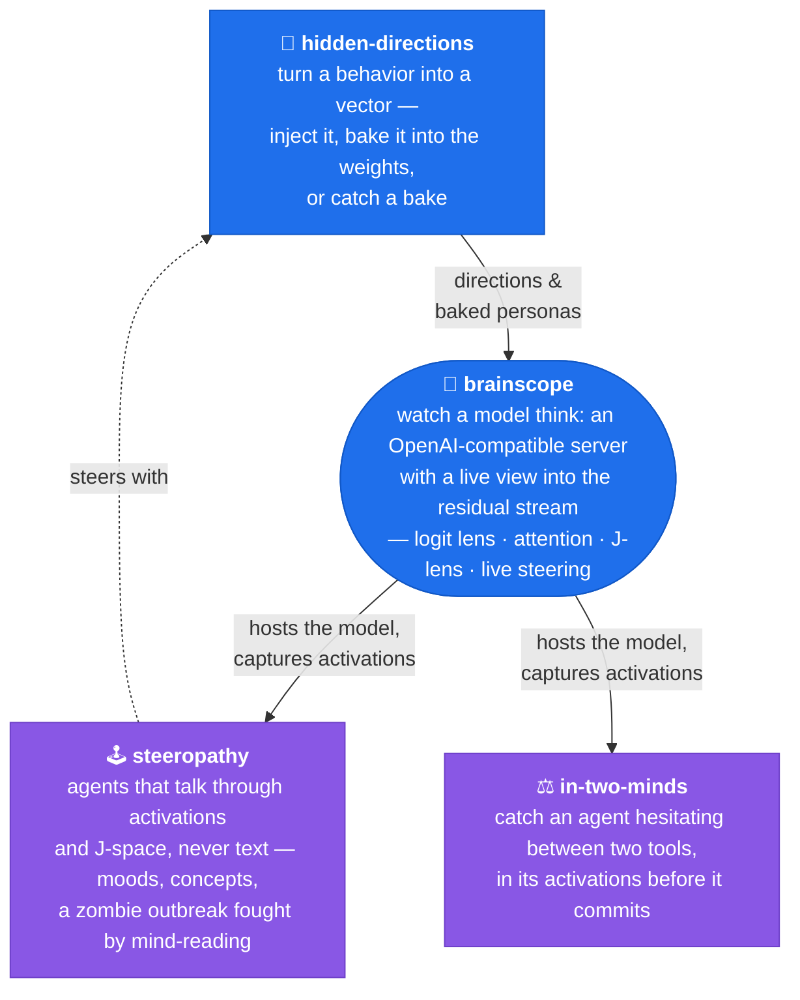

# Hey, I'm Kate 👋

**AI Engineer** • Former Particle Physicist ⚛️ • Former Risk Modeler 📈

I build tools that make neural networks less mysterious.

Because I believe interpretability shouldn't stay in research papers—it belongs in production.

My work sits at the intersection of **mechanistic interpretability**, **model visualization**, and **explainable AI**. I'm fascinated by what happens inside modern language and vision models—and I enjoy turning those hidden processes into interactive experiments that anyone can explore. Most of my projects are ways to **look inside AI** — the map of how they fit together is below.

The house rules, in every repo: each experiment ships with a **placebo control**, its **negative results stay published**, and when a finding turns out to be about my own instrument instead of the model, that page says so. Half the fun is the honest notes.

### What I care about

* 🧠 Mechanistic interpretability
* 🔍 Understanding *why* models behave the way they do
* 📊 Interactive visualizations of neural networks
* ⚡ Practical, local-first AI
* 🚀 Open-source tools that make AI more transparent

## 💥 Come say hi in my collision chamber

My personal site is a chat with a tiny LLM running entirely in your browser, and every answer it generates renders as a real particle collision. Click the event below to fire your own question into the chamber:

## 🚀 How my projects fit together

> One engine for looking inside a model, one factory for the directions it steers with, and the experiments that run on both. **Click any box to open its repo.**

**The two blue boxes are the instrument.** [brainscope](https://github.com/moudrkat/brainscope) hosts any Hugging Face model and streams its internals to the browser; [hidden-directions](https://github.com/moudrkat/hidden-directions) makes the steering vectors — and bakes them into weights, then audits for the bake. **The two purple boxes are experiments run under that lens.** [steeropathy](https://github.com/moudrkat/steeropathy) wires agents together through activations instead of text; [in-two-minds](https://github.com/moudrkat/in-two-minds) catches an agent hesitating between tools before it commits.

---

### 🔬 Also on the bench

Smaller, self-contained ways to look inside:

- 📜 [paper-remembers](https://github.com/moudrkat/paper-remembers) — Hopfield's 1982 paper, running live: rub out any part of the page and watch it rebuild itself
- 🎬 [green-room](https://github.com/moudrkat/green-room) — a multi-character agent has already cast the scene before it writes a word of dialogue; see it in the activations, then recast it
- 🎭 [sixteen-voices](https://github.com/moudrkat/sixteen-voices) — how a tiny transformer encodes writing style, through LoRA adapters and attention heads
- 👁️ [show-me-your-attention](https://github.com/moudrkat/show-me-your-attention) — attention maps and neuron activations over your own prompt
- 💥 [detektor](https://github.com/moudrkat/detektor) — the collision chamber above, open source (SmolLM2 in your browser, no server)
- 🖼️ [jepa-demo](https://github.com/moudrkat/jepa-demo) — I-JEPA & V-JEPA 2 hands-on, no GPU needed, with a visual deep-dive article
- 🍄 [Mushroom-generator](https://github.com/moudrkat/Mushroom-generator) — a VAE growing mushrooms, with latent-space walks and the decoder taken apart layer by layer
- 🍎 [Applepear](https://github.com/moudrkat/Applepear) — apples vs pears in a tiny CNN, activations and grad-CAM included
- ⚙️ [Minimize_me](https://github.com/moudrkat/Minimize_me) — race TensorFlow optimizers across loss landscapes

### 🃏 And off the bench

- 👑 [KingOfDiamonds](https://github.com/moudrkat/KingOfDiamonds) — the King of Diamonds game from *Alice in Borderland*, played by LLMs in character, recursive strategic thinking and all
- 🗨️ [paralel-discordverse](https://github.com/moudrkat/paralel-discordverse) — your company's Discord gets a parallel universe, populated entirely by fictional colleagues
- 🧮 [least-squares-method](https://github.com/moudrkat/least-squares-method) — code archaeology: a printed Pascal listing, photographed page by page and revived on Turbo Pascal 5.5

---
