# Hey, I'm Kate 👋

**AI Engineer** • Former Particle Physicist ⚛️ • Former Risk Modeler 📈

I've spent my whole career looking inside systems that would rather stay
opaque — first particle collisions, then risk models, now neural networks.

> The models talk to us all day. **I want to be able to affect them back.**

So I build tools that make neural networks less mysterious — because
interpretability shouldn't stay in research papers, it belongs in
production. (And in zombie games. And in mushroom generators. You'll see.)

## 💥 Come say hi in my collision chamber

My personal site is a chat with a tiny LLM running entirely in your browser, and every answer it generates renders as a real particle collision. Click the event below to fire your own question into the chamber:

## 🚀 My main project is an opensource model interpretability lab - I develop it here and experiment with it on a real production app

> [!TIP]
> **Don't read — just do it.** Every repo is `pip install`-able, most run on CPU or a free Colab GPU, and each has a demo that shows something real in ~2 minutes before you configure anything — `brainscope --model tiny` opens a browser view of a model thinking; `make demo` in steering-mechanics renders real measured figures with no GPU at all. Point your own OpenAI client at brainscope and watch your app's traffic. No account, no course — clone and look.

> One engine for looking inside a model, one factory for the directions it steers with, and the experiments that run on both. **Click any box to open its repo.**

```mermaid
flowchart TD
    hd["🧭 <b>hidden-directions</b><br/>behavior → vector"]
    bs(["🧠 <b>brainscope</b><br/>watch your app&#39;s model think"])
    st["🕹️ <b>steeropathy</b><br/>agents talking through activations"]
    tm["⚖️ <b>in-two-minds</b><br/>agent hesitating between tools"]
    hw["🔥 <b>hotwire-vllm</b><br/>steering in production vLLM"]
    sm["🧪 <b>steering-mechanics</b><br/>how steering actually works"]

    hd -->|"vectors"| bs
    bs -->|"hosts & captures"| st
    bs -->|"hosts & captures"| tm
    st -.->|"steers with"| hd
    hd -->|"vector + passport"| hw
    bs <-.->|"same spec: lab ↔ prod"| hw
    bs -->|"causal replay"| sm
    hw -.->|"vector under study"| sm

    click hd "https://github.com/moudrkat/hidden-directions"
    click bs "https://github.com/moudrkat/brainscope"
    click st "https://github.com/moudrkat/steeropathy"
    click tm "https://github.com/moudrkat/in-two-minds"
    click hw "https://github.com/moudrkat/hotwire-vllm"
    click sm "https://github.com/moudrkat/steering-mechanics"

    classDef engine fill:#1f6feb,stroke:#1158c7,color:#ffffff;
    classDef exp fill:#8957e5,stroke:#6e40c9,color:#ffffff;
    class bs,hd,hw engine;
    class st,tm,sm exp;
```

> **The blue boxes are the instrument.** [brainscope](https://github.com/moudrkat/brainscope) hosts any Hugging Face model and streams its internals to the browser; [hidden-directions](https://github.com/moudrkat/hidden-directions) makes the steering vectors — auto-calibrates them (Optuna, with a KL damage guard), bakes them into weights, then audits for the bake; [hotwire-vllm](https://github.com/moudrkat/hotwire-vllm) takes those vectors to production — steering inside vLLM's CUDA graphs, per request, steered speed = vanilla vLLM. All three speak one steering spec: a vector calibrated under the lens deploys unchanged, and a misbehaving production conversation replays back under the lens.

> **The purple boxes are experiments run under that lens.** [steeropathy](https://github.com/moudrkat/steeropathy) wires agents together through activations instead of text; [in-two-minds](https://github.com/moudrkat/in-two-minds) catches an agent hesitating between tools before it commits; [steering-mechanics](https://github.com/moudrkat/steering-mechanics) asks how steering vectors actually work inside the model — first findings: the dose has a threshold, and the suppression is entirely circuit-mediated.

---

### 🔬 Also on the bench

Smaller, self-contained ways to look inside:

- 📜 [paper-remembers](https://github.com/moudrkat/paper-remembers) — Hopfield's 1982 paper, running live: rub out any part of the page and watch it rebuild itself
- 🎭 [sixteen-voices](https://github.com/moudrkat/sixteen-voices) — how a tiny transformer encodes writing style, through LoRA adapters and attention heads
- 👁️ [show-me-your-attention](https://github.com/moudrkat/show-me-your-attention) — attention maps and neuron activations over your own prompt
- 💥 [detektor](https://github.com/moudrkat/detektor) — the collision chamber above, open source (SmolLM2 in your browser, no server)
- 🖼️ [jepa-demo](https://github.com/moudrkat/jepa-demo) — I-JEPA & V-JEPA 2 hands-on, no GPU needed, with a visual deep-dive article
- 🍄 [Mushroom-generator](https://github.com/moudrkat/Mushroom-generator) — a VAE growing mushrooms, with latent-space walks and the decoder taken apart layer by layer
- 🍎 [Applepear](https://github.com/moudrkat/Applepear) — apples vs pears in a tiny CNN, activations and grad-CAM included
- ⚙️ [Minimize_me](https://github.com/moudrkat/Minimize_me) — race TensorFlow optimizers across loss landscapes

### 🃏 And off the bench

- 🎨 [personal-rembrandt](https://github.com/moudrkat/personal-rembrandt) — you can't build a personal brand, so build a personal Rembrandt: paste your bio, GPT-2 reads it in your browser, and its activations repaint his 1659 self-portrait. 
- 🛏️ [go-to-damn-bed](https://github.com/moudrkat/go-to-damn-bed) — a Claude Code skill that sends you to bed like a mom sends naughty children: it saves your work into TOMORROW.md, then counts to three. It never says what happens at three
- 👑 [KingOfDiamonds](https://github.com/moudrkat/KingOfDiamonds) — the King of Diamonds game from *Alice in Borderland*, played by LLMs in character, recursive strategic thinking and all
- 🗨️ [paralel-discordverse](https://github.com/moudrkat/paralel-discordverse) — your company's Discord gets a parallel universe, populated entirely by fictional colleagues
- 🧮 [least-squares-method](https://github.com/moudrkat/least-squares-method) — code archaeology: a printed Pascal listing, photographed page by page and revived on Turbo Pascal 5.5

---

None of it is perfect. *That's kind of delightful.*
