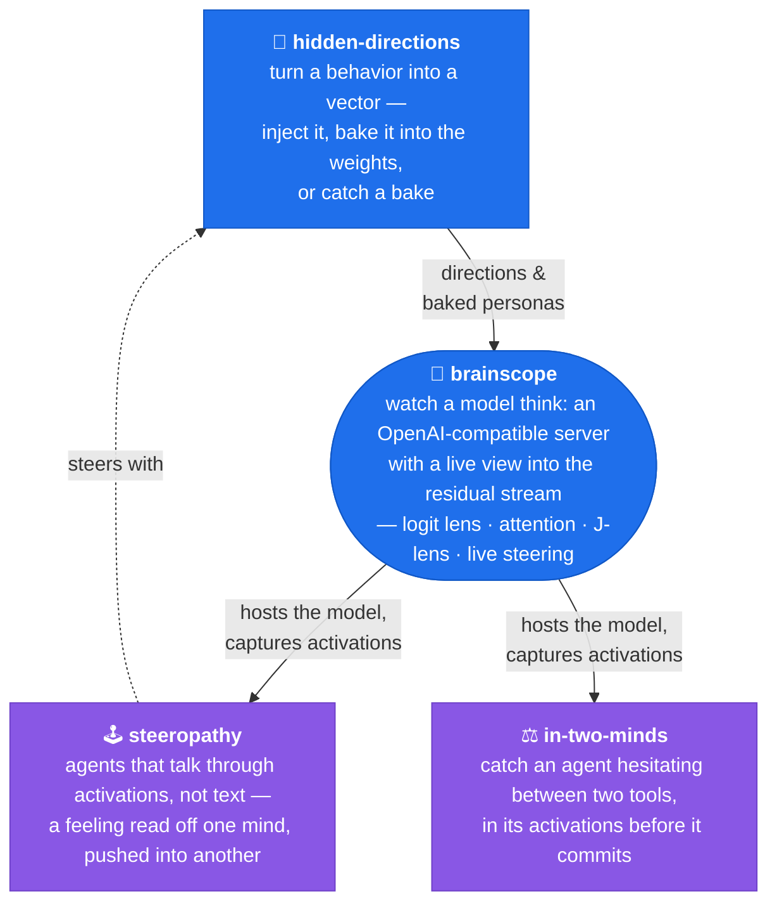

# Hey, I'm Kate 👋

**AI Engineer** • Former Particle Physicist ⚛️ • Former Risk Modeler 📈

I build tools that make neural networks less mysterious.

Because I believe interpretability shouldn't stay in research papers—it belongs in production.

My work sits at the intersection of **mechanistic interpretability**, **model visualization**, and **explainable AI**. I'm fascinated by what happens inside modern language and vision models—and I enjoy turning those hidden processes into interactive experiments that anyone can explore.

Most of my projects are ways to **look inside AI**.

I'm the creator of **Brainscope**, an OpenAI-compatible inference server that streams live visualizations of transformer activations as a model generates text. I've also built projects exploring hidden directions in transformer weights, attention visualization, LoRA interpretability, and self-supervised vision models like JEPA.

### What I care about

* 🧠 Mechanistic interpretability
* 🔍 Understanding *why* models behave the way they do
* 📊 Interactive visualizations of neural networks
* ⚡ Practical, local-first AI
* 🚀 Open-source tools that make AI more transparent

## 💥 Come say hi in my collision chamber

My personal site is a chat with a tiny LLM running entirely in your browser, and every answer it generates renders as a real particle collision. Click the event below to fire your own question into the chamber:

## 🚀 How my projects fit together

> One engine for looking inside a model, one factory for the directions it steers with, and the experiments that run on both. **Click any box to open its repo.**

**The two blue boxes are the instrument.** [brainscope](https://github.com/moudrkat/brainscope) hosts any Hugging Face model and streams its internals to the browser; [hidden-directions](https://github.com/moudrkat/hidden-directions) makes the steering vectors — and bakes them into weights, then audits for the bake. **The two purple boxes are experiments run under that lens.** [steeropathy](https://github.com/moudrkat/steeropathy) wires agents together through activations instead of text; [in-two-minds](https://github.com/moudrkat/in-two-minds) catches an agent hesitating between tools before it commits.

---

**Also on the bench:** 🎭 [Sixteen Voices](https://github.com/moudrkat/sixteen-voices) — how tiny transformers encode writing style with LoRA adapters and attention heads.

---
