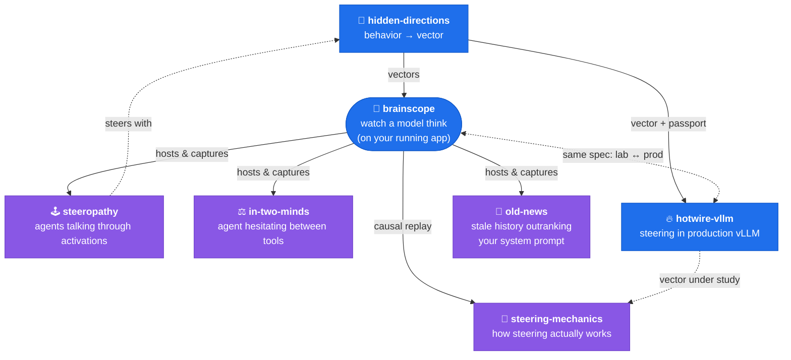

# Hey, I'm Kate 👋

**AI Engineer** • Former Particle Physicist ⚛️ • Former Risk Modeler 📈

I've spent my whole career looking inside systems that would rather stay
opaque — first particle collisions, then risk models, now neural networks.

> The models talk to us all day. **I want to be able to affect them back.**

**[Why I'm really doing this → the manifesto](MANIFESTO.md)**

## 💥 Come say hi in my collision chamber

My personal site is a chat with a tiny LLM running entirely in your browser, and every answer it generates renders as a real particle collision. Click the event below to fire your own question into the chamber:

[](https://unt1l1f1nd-detektor.static.hf.space)

## 🚀 An open-source interpretability lab, tested on a real production app

> **The stack that makes a model legible in production — from watching, to diagnosing, to fixing.**
> *Watch* it think ([brainscope](https://github.com/moudrkat/brainscope)) → *diagnose* why it did that (causal replay + the lens) → *fix* it at the source with a calibrated steering vector, receipts attached ([hidden-directions](https://github.com/moudrkat/hidden-directions) → [hotwire-vllm](https://github.com/moudrkat/hotwire-vllm)). Observability first; intervention last, once the instruments have earned it.

> [!TIP]
> **Don't read — just do it.** The core of the lab is on PyPI:
>
> ```
> pip install hidden-directions brainscope hotwire-vllm
> ```
>
> — the vector factory, the live lens server, the production vLLM plugin. CPU is fine:
> - `brainscope --model tiny` — a browser view of a model thinking
> - point your own OpenAI client at brainscope — watch your app's live traffic
>
> No account, no course — install and look.

**Click any box to open its repo.**


```mermaid
flowchart TD
    hd["🧭 <b>hidden-directions</b><br/>behavior → vector"]
    bs(["🧠 <b>brainscope</b><br/>watch a model think<br/>(on your running app)"])
    st["🕹️ <b>steeropathy</b><br/>agents talking through activations"]
    tm["⚖️ <b>in-two-minds</b><br/>agent hesitating between tools"]
    hw["🔥 <b>hotwire-vllm</b><br/>steering in production vLLM"]
    sm["🧪 <b>steering-mechanics</b><br/>how steering actually works"]
    on["📰 <b>old-news</b><br/>stale history outranking<br/>your system prompt"]

    hd -->|"vectors"| bs
    bs -->|"hosts & captures"| st
    bs -->|"hosts & captures"| tm
    st -.->|"steers with"| hd
    hd -->|"vector + passport"| hw
    bs <-.->|"same spec: lab ↔ prod"| hw
    bs -->|"causal replay"| sm
    hw -.->|"vector under study"| sm
    bs -->|"hosts & captures"| on

    click hd "https://github.com/moudrkat/hidden-directions"
    click bs "https://github.com/moudrkat/brainscope"
    click st "https://github.com/moudrkat/steeropathy"
    click tm "https://github.com/moudrkat/in-two-minds"
    click hw "https://github.com/moudrkat/hotwire-vllm"
    click sm "https://github.com/moudrkat/steering-mechanics"
    click on "https://github.com/moudrkat/old-news"

    classDef engine fill:#1f6feb,stroke:#1158c7,color:#ffffff;
    classDef exp fill:#8957e5,stroke:#6e40c9,color:#ffffff;
    class bs,hd,hw engine;
    class st,tm,sm,on exp;
```

---

## 🤝 What I'm looking for

**Collaborators and users** — not a job (see the [manifesto](MANIFESTO.md)).
Build on LLMs and want to see inside your model? `pip install`, try it, and
open an issue where it breaks. Work on steering or interpretability? Run
[SteerBench](https://github.com/moudrkat/steering-mechanics/tree/main/steerbench)
against your own method and tell me what you get.

---

<details>
<summary>🔬 <b>Also on the bench</b> — smaller, self-contained ways to look inside</summary>

- 🔦 [tournament-watermarking](https://github.com/moudrkat/tournament-watermarking) — the watermark Anthropic now puts in Claude’s output, running live as a decaying newspaper: two columns from the same model, one of them watermarked, and a torch you hold to the page to find out which
- 📜 [paper-remembers](https://github.com/moudrkat/paper-remembers) — Hopfield's 1982 paper, running live: rub out any part of the page and watch it rebuild itself
- 🎭 [sixteen-voices](https://github.com/moudrkat/sixteen-voices) — how a tiny transformer encodes writing style, through LoRA adapters and attention heads
- 👁️ [show-me-your-attention](https://github.com/moudrkat/show-me-your-attention) — attention maps and neuron activations over your own prompt
- 💥 [detektor](https://github.com/moudrkat/detektor) — the collision chamber above, open source (SmolLM2 in your browser, no server)
- 🖼️ [jepa-demo](https://github.com/moudrkat/jepa-demo) — I-JEPA & V-JEPA 2 hands-on, no GPU needed, with a visual deep-dive article
- 🍄 [Mushroom-generator](https://github.com/moudrkat/Mushroom-generator) — a VAE growing mushrooms, with latent-space walks and the decoder taken apart layer by layer
- 🍎 [Applepear](https://github.com/moudrkat/Applepear) — apples vs pears in a tiny CNN, activations and grad-CAM included
- ⚙️ [Minimize_me](https://github.com/moudrkat/Minimize_me) — race TensorFlow optimizers across loss landscapes
</details>

<details>
<summary>🃏 <b>And off the bench</b></summary>

- 🌙 [tri-kumpani](https://github.com/moudrkat/tri-kumpani) — Li Po's *Drinking Alone under the Moon*, read by a small Chinese model twelve hundred years later: tap a token to see which words it raises its cup to, head by head, then pour it wine and watch the next verse fall apart into Chinese characters. The tokenized poem is also printed on a jacket. [▶ open it](https://moudrkat.github.io/tri-kumpani/)
- 🚪 [resi-doom](https://github.com/moudrkat/resi-doom) — Doom, except the level is a language model mid-sentence: one chamber per layer, attention matrices for windows, the residual stream painted on the walls. `W` and `S`. That is the control scheme. [▶ open it](https://unt1l1f1nd-resi-doom.static.hf.space)
- 🎸 [unlived](https://github.com/moudrkat/unlived) — a gamebook of the life you never lived: it writes that life as a playable story, and you win by quitting the game to go live it for real
- 🎉 [promptparty](https://github.com/moudrkat/promptparty) — born mid-hackathon, shipped the same day: a dashboard for friends agent-coding in one room that says when to 🗣️ TALK (all agents cooking) and when to ⌨️ PROMPT (someone's agent is waiting). Claude Code hooks report automatically; `pip install promptparty`
- 🎨 [personal-rembrandt](https://github.com/moudrkat/personal-rembrandt) — you can't build a personal brand, so build a personal Rembrandt: paste your bio, GPT-2 reads it in your browser, and its activations repaint his 1659 self-portrait.
- 🛏️ [go-to-damn-bed](https://github.com/moudrkat/go-to-damn-bed) — a Claude Code skill that sends you to bed like a mom sends naughty children: it saves your work into TOMORROW.md, then counts to three. It never says what happens at three
- 👑 [KingOfDiamonds](https://github.com/moudrkat/KingOfDiamonds) — the King of Diamonds game from *Alice in Borderland*, played by LLMs in character, recursive strategic thinking and all
- 🗨️ [paralel-discordverse](https://github.com/moudrkat/paralel-discordverse) — your company's Discord gets a parallel universe, populated entirely by fictional colleagues
- 🧅 [underglaze](https://github.com/moudrkat/underglaze) — the blue tile on a kitchen wall, written as a sum of cosines: 62 815 of them for 99 %. Three knobs to drag, and one of them turns the plant into a snowflake. The pattern everyone here calls *cibulák* turns out to have no onion in it
- 🌧️ [coalescence](https://github.com/moudrkat/coalescence) — a raindrop landing on an already-wet window doesn't splash and doesn't soak in, it stops being a drop and becomes film. The thin-film equation, solved and rendered in your browser: there is no drop in the equation, the drop is only where it starts
- 🧮 [least-squares-method](https://github.com/moudrkat/least-squares-method) — code archaeology: a printed Pascal listing, photographed page by page and revived on Turbo Pascal 5.5
</details>

---

None of it is perfect. *That's kind of delightful.*
